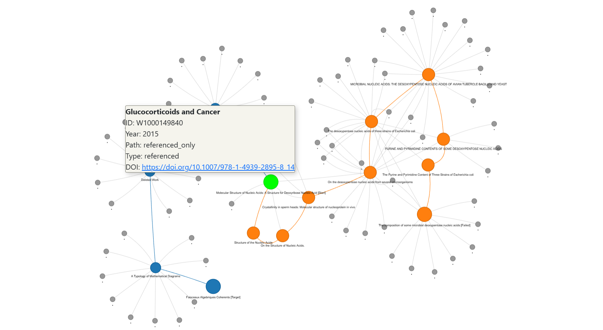
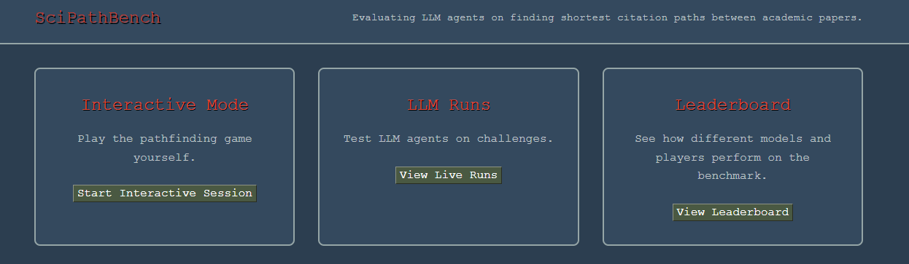

# SciPathBench

A benchmark for evaluating LLM agents on finding shortest citation paths between academic papers.
Inspired by [WikiBench](https://1thousandfaces.substack.com/p/wikibench-76-of-sota-models-fail) | Uses [OpenAlex](OpenAlex), [OpenRouter](https://openrouter.ai/), [Inciteful](https://inciteful.xyz/) and [OpenCitations](https://opencitations.net/) APIs.



## Quick Start

```bash
# Add OPENROUTER_API_KEY to .env file
# Modify config.py for LLM model and agent settings
uv sync

# Generate benchmark data (optional - web interface works without it)
uv run src/generate_data.py

# Launch web interface (recommended)
uv run web.py

# Or run command line versions:
# Run LLM benchmark
uv run main.py

# Play interactively as a human
uv run main.py --interactive

# Add papers to dataset
uv run python -m src.data.get_dois --top 75 --since 2010 --out output/landmark_papers.json

```

## Web Interface

The web interface provides a modern, user-friendly way to interact with SciPathBench, using using [cs16.css](https://cs16.samke.me/) for styling:



- **Interactive Mode**: Play the pathfinding game in your browser with a clean UI

- **Live LLM Runs**: Watch AI agents solve challenges in real-time with live updates

- **Leaderboard**: View performance metrics, compare models, and track progress

Access at: `http://localhost:8001` after running `uv run web.py`

## How It Works

**Data Generation**: `generate_benchmark_data.py` creates problems using Inciteful API to find shortest citation paths between papers found in `dataset.py`, with results saved to `benchmark_pairs.json`.

**Evaluation**: `main.py` runs the benchmark. LLM agents navigate citation graphs turn-by-turn, scored on success and optimality vs ground truth.

**Interactive Mode**: Human players can play the same pathfinding game using `--interactive` flag. Players choose which papers to expand each turn, trying to find the shortest path between academic papers through citation networks.

**Graph Representation**: Uses a unified `PaperGraph` structure where each node represents a paper with consistent attributes (title, year, concepts, DOI, node_type). The agent's actual path is tracked directly without complex reconstruction.

**Visualization**: `visualization.py` generates VOSviewer files and interactive HTML visualizations showing:

- **Blue**: Ground truth path nodes
- **Orange**: Agent path nodes  
- **Green**: Nodes in both paths
- **Grey dots**: Referenced-only nodes (hover for details)
- **Special markers**: [Start], [Target], [Success], [Failed]

Results saved to `scipathbench_results.json`
